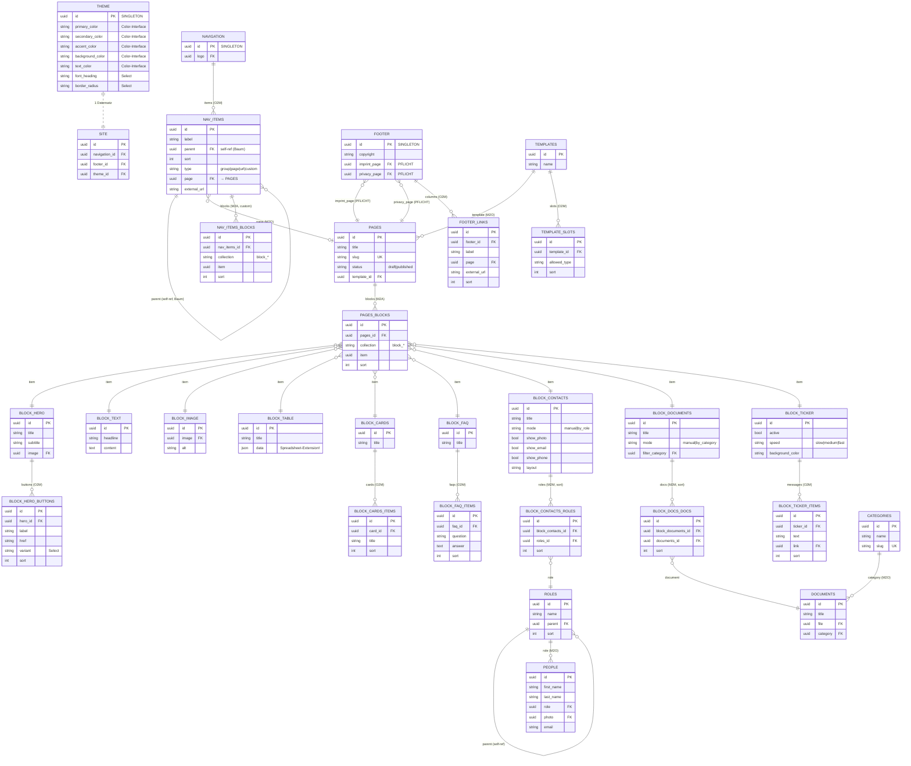

```mermaid
erDiagram
    %% ===== GLOBALS (Singletons) =====
    THEME ||..|| SITE : "1 Datensatz"
    NAVIGATION ||--o{ NAV_ITEMS : "items (O2M)"
    NAV_ITEMS ||--o{NAV_ITEMS : "parent (self-ref, Baum)"
    NAV_ITEMS}o--o| PAGES : "page (M2O)"
    NAV_ITEMS ||--o{NAV_ITEMS_BLOCKS : "blocks (M2A, custom)"
    FOOTER}o--|| PAGES : "imprint_page (PFLICHT)"
    FOOTER }o--|| PAGES : "privacy_page (PFLICHT)"
    FOOTER ||--o{ FOOTER_LINKS : "columns (O2M)"

    %% ===== STRUKTUR =====
    PAGES ||--o{ PAGES_BLOCKS : "blocks (M2A)"
    TEMPLATES ||--o{ PAGES : "template (M2O)"
    TEMPLATES ||--o{TEMPLATE_SLOTS : "slots (O2M)"

    %% ===== BLÖCKE (M2A) =====
    PAGES_BLOCKS}o--|| BLOCK_HERO      : "item"
    PAGES_BLOCKS }o--|| BLOCK_TEXT      : "item"
    PAGES_BLOCKS }o--|| BLOCK_IMAGE     : "item"
    PAGES_BLOCKS }o--|| BLOCK_TABLE     : "item"
    PAGES_BLOCKS }o--|| BLOCK_CARDS     : "item"
    PAGES_BLOCKS }o--|| BLOCK_FAQ       : "item"
    PAGES_BLOCKS }o--|| BLOCK_CONTACTS  : "item"
    PAGES_BLOCKS }o--|| BLOCK_DOCUMENTS : "item"
    PAGES_BLOCKS }o--|| BLOCK_TICKER    : "item"

    %% ===== O2M statt JSON =====
    BLOCK_HERO   ||--o{ BLOCK_HERO_BUTTONS  : "buttons (O2M)"
    BLOCK_CARDS  ||--o{ BLOCK_CARDS_ITEMS   : "cards (O2M)"
    BLOCK_FAQ    ||--o{ BLOCK_FAQ_ITEMS     : "faqs (O2M)"
    BLOCK_TICKER ||--o{ BLOCK_TICKER_ITEMS  : "messages (O2M)"

    %% ===== DATA-BOUND =====
    BLOCK_CONTACTS  ||--o{BLOCK_CONTACTS_ROLES : "roles (M2M, sort)"
    BLOCK_CONTACTS_ROLES}o--|| ROLES           : "role"
    BLOCK_DOCUMENTS ||--o{BLOCK_DOCS_DOCS      : "docs (M2M, sort)"
    BLOCK_DOCS_DOCS}o--|| DOCUMENTS            : "document"

    %% ===== STAMMDATEN + TAXONOMIE =====
    ROLES ||--o{ ROLES         : "parent (self-ref)"
    ROLES ||--o{ PEOPLE        : "role (M2O)"
    CATEGORIES ||--o{ DOCUMENTS : "category (M2O)"

    %% ===== ATTRIBUTE =====
    SITE {
        uuid id PK
        uuid navigation_id FK
        uuid footer_id FK
        uuid theme_id FK
    }
    THEME {
        uuid id PK "SINGLETON"
        string primary_color "Color-Interface"
        string secondary_color "Color-Interface"
        string accent_color "Color-Interface"
        string background_color "Color-Interface"
        string text_color "Color-Interface"
        string font_heading "Select"
        string border_radius "Select"
    }
    NAVIGATION {
        uuid id PK "SINGLETON"
        uuid logo FK
    }
    NAV_ITEMS {
        uuid id PK
        string label
        uuid parent FK "self-ref (Baum)"
        int sort
        string type "group|page|url|custom"
        uuid page FK "→ PAGES"
        string external_url
    }
    NAV_ITEMS_BLOCKS {
        uuid id PK
        uuid nav_items_id FK
        string collection "block_*"
        uuid item
        int sort
    }
    FOOTER {
        uuid id PK "SINGLETON"
        string copyright
        uuid imprint_page FK "PFLICHT"
        uuid privacy_page FK "PFLICHT"
    }
    FOOTER_LINKS {
        uuid id PK
        uuid footer_id FK
        string label
        uuid page FK
        string external_url
        int sort
    }
    PAGES {
        uuid id PK
        string title
        string slug UK
        string status "draft|published"
        uuid template_id FK
    }
    PAGES_BLOCKS {
        uuid id PK
        uuid pages_id FK
        string collection "block_*"
        uuid item
        int sort
    }
    BLOCK_TICKER {
        uuid id PK
        bool active
        string speed "slow|medium|fast"
        string background_color
    }
    BLOCK_TICKER_ITEMS {
        uuid id PK
        uuid ticker_id FK
        string text
        uuid link FK
        int sort
    }
    BLOCK_HERO {
        uuid id PK
        string title
        string subtitle
        uuid image FK
    }
    BLOCK_HERO_BUTTONS {
        uuid id PK
        uuid hero_id FK
        string label
        string href
        string variant "Select"
        int sort
    }
    BLOCK_TEXT { uuid id PK
        string headline
        text content }
    BLOCK_IMAGE { uuid id PK
        uuid image FK
        string alt }
    BLOCK_TABLE { uuid id PK
        string title
        json data "Spreadsheet-Extension!" }
    BLOCK_CARDS { uuid id PK
        string title }
    BLOCK_CARDS_ITEMS { uuid id PK
        uuid card_id FK
        string title
        int sort }
    BLOCK_FAQ { uuid id PK
        string title }
    BLOCK_FAQ_ITEMS { uuid id PK
        uuid faq_id FK
        string question
        text answer
        int sort }
    BLOCK_CONTACTS {
        uuid id PK
        string title
        string mode "manual|by_role"
        bool show_photo
        bool show_email
        bool show_phone
        string layout
    }
    BLOCK_CONTACTS_ROLES { uuid id PK
        uuid block_contacts_id FK
        uuid roles_id FK
        int sort }
    BLOCK_DOCUMENTS {
        uuid id PK
        string title
        string mode "manual|by_category"
        uuid filter_category FK
    }
    BLOCK_DOCS_DOCS { uuid id PK
        uuid block_documents_id FK
        uuid documents_id FK
        int sort }
    ROLES { uuid id PK
        string name
        uuid parent FK
        int sort }
    PEOPLE { uuid id PK
        string first_name
        string last_name
        uuid role FK
        uuid photo FK
        string email }
    DOCUMENTS { uuid id PK
        string title
        uuid file FK
        uuid category FK }
    CATEGORIES { uuid id PK
        string name
        string slug UK }
    TEMPLATES { uuid id PK
        string name }
    TEMPLATE_SLOTS { uuid id PK
        uuid template_id FK
        string allowed_type
        int sort }
```