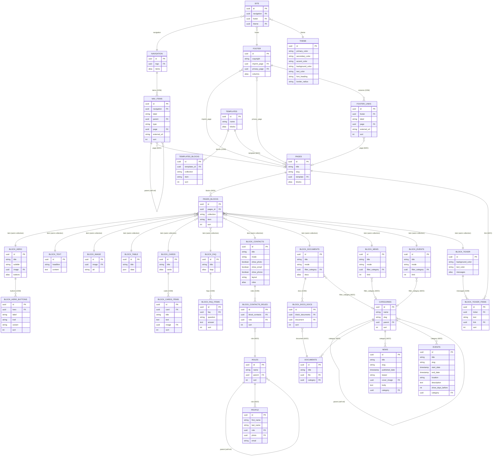

# Directus v12 - Datenmodell aus `cms/snapshots/snapshot.json`

```mermaid
erDiagram
    %% ===== GLOBALE KONFIGURATION =====
    SITE }o--|| NAVIGATION : "navigation"
    SITE }o--|| FOOTER : "footer"
    SITE }o--|| THEME : "theme"
    NAVIGATION ||--o{ NAV_ITEMS : "items (O2M)"
    NAV_ITEMS ||--o{ NAV_ITEMS : "parent (self-ref)"
    NAV_ITEMS }o--o| PAGES : "page (M2O)"
    FOOTER }o--|| PAGES : "imprint_page"
    FOOTER }o--|| PAGES : "privacy_page"
    FOOTER ||--o{ FOOTER_LINKS : "columns (O2M)"
    FOOTER_LINKS }o--o| PAGES : "page (M2O)"

    %% ===== SEITEN UND TEMPLATES =====
    TEMPLATES ||--o{ TEMPLATES_BLOCKS : "blocks (O2M)"
    TEMPLATES ||--o{ PAGES : "template (M2O)"
    PAGES ||--o{ PAGES_BLOCKS : "blocks (M2A)"

    %% collection + item bilden die polymorphe M2A-Verknuepfung.
    PAGES_BLOCKS }o--|| BLOCK_HERO : "item (wenn collection)"
    PAGES_BLOCKS }o--|| BLOCK_TEXT : "item (wenn collection)"
    PAGES_BLOCKS }o--|| BLOCK_IMAGE : "item (wenn collection)"
    PAGES_BLOCKS }o--|| BLOCK_TABLE : "item (wenn collection)"
    PAGES_BLOCKS }o--|| BLOCK_CARDS : "item (wenn collection)"
    PAGES_BLOCKS }o--|| BLOCK_FAQ : "item (wenn collection)"
    PAGES_BLOCKS }o--|| BLOCK_CONTACTS : "item (wenn collection)"
    PAGES_BLOCKS }o--|| BLOCK_DOCUMENTS : "item (wenn collection)"
    PAGES_BLOCKS }o--|| BLOCK_NEWS : "item (wenn collection)"
    PAGES_BLOCKS }o--|| BLOCK_EVENTS : "item (wenn collection)"
    PAGES_BLOCKS }o--|| BLOCK_TICKER : "item (wenn collection)"

    %% ===== BLOCK-INHALTE =====
    BLOCK_HERO ||--o{ BLOCK_HERO_BUTTONS : "buttons (O2M)"
    BLOCK_CARDS ||--o{ BLOCK_CARDS_ITEMS : "cards (O2M)"
    BLOCK_FAQ ||--o{ BLOCK_FAQ_ITEMS : "faqs (O2M)"
    BLOCK_TICKER ||--o{ BLOCK_TICKER_ITEMS : "messages (O2M)"
    BLOCK_CONTACTS ||--o{ BLOCK_CONTACTS_ROLES : "roles (O2M)"
    BLOCK_CONTACTS_ROLES }o--|| ROLES : "role (M2O)"
    BLOCK_DOCUMENTS ||--o{ BLOCK_DOCS_DOCS : "docs (O2M)"
    BLOCK_DOCS_DOCS }o--|| DOCUMENTS : "document (M2O)"
    BLOCK_DOCUMENTS }o--o| CATEGORIES : "filter_category (M2O)"
    BLOCK_NEWS }o--o| CATEGORIES : "filter_category (M2O)"
    BLOCK_EVENTS }o--o| CATEGORIES : "filter_category (M2O)"

    %% ===== CONTENT UND STAMMDATEN =====
    CATEGORIES ||--o{ CATEGORIES : "parent (self-ref)"
    ROLES ||--o{ ROLES : "parent (self-ref)"
    ROLES ||--o{ PEOPLE : "role (M2O)"
    CATEGORIES ||--o{ DOCUMENTS : "category (M2O)"
    CATEGORIES ||--o{ NEWS : "category (M2O)"
    CATEGORIES ||--o{ EVENTS : "category (M2O)"
    PAGES ||--o{ BLOCK_TICKER_ITEMS : "link (M2O)"

    SITE {
        uuid id PK
        uuid navigation FK
        uuid footer FK
        uuid theme FK
    }
    THEME {
        uuid id PK
        string primary_color
        string secondary_color
        string accent_color
        string background_color
        string text_color
        string font_heading
        string border_radius
    }
    NAVIGATION {
        uuid id PK
        uuid logo FK
        alias items
    }
    NAV_ITEMS {
        uuid id PK
        uuid navigation FK
        string label
        uuid parent FK
        string type
        uuid page FK
        string external_url
        int sort
    }
    FOOTER {
        uuid id PK
        string copyright
        uuid imprint_page FK
        uuid privacy_page FK
        alias columns
    }
    FOOTER_LINKS {
        uuid id PK
        uuid footer FK
        string label
        uuid page FK
        string external_url
        int sort
    }
    PAGES {
        uuid id PK
        string title
        string slug
        uuid template FK
        alias blocks
    }
    PAGES_BLOCKS {
        uuid id PK
        uuid pages_id FK
        string collection
        string item
        int sort
    }
    TEMPLATES {
        uuid id PK
        string name
        alias blocks
    }
    TEMPLATES_BLOCKS {
        uuid id PK
        uuid templates_id FK
        string collection
        string item
        int sort
    }

    BLOCK_HERO {
        uuid id PK
        string title
        string subtitle
        uuid image FK
        alias buttons
    }
    BLOCK_HERO_BUTTONS {
        uuid id PK
        uuid hero FK
        string label
        string href
        string variant
        int sort
    }
    BLOCK_TEXT {
        uuid id PK
        string headline
        text content
    }
    BLOCK_IMAGE {
        uuid id PK
        uuid image FK
        string alt
    }
    BLOCK_TABLE {
        uuid id PK
        string title
        json data
    }
    BLOCK_CARDS {
        uuid id PK
        string title
        alias cards
    }
    BLOCK_CARDS_ITEMS {
        uuid id PK
        uuid card FK
        string title
        text text
        uuid image FK
        int sort
    }
    BLOCK_FAQ {
        uuid id PK
        string title
        alias faqs
    }
    BLOCK_FAQ_ITEMS {
        uuid id PK
        uuid faq FK
        string question
        text answer
        int sort
    }
    BLOCK_TICKER {
        uuid id PK
        string background_color
        string text_color
        alias messages
    }
    BLOCK_TICKER_ITEMS {
        uuid id PK
        uuid ticker FK
        string text
        uuid link FK
        int sort
    }
    BLOCK_CONTACTS {
        uuid id PK
        string title
        string mode
        boolean show_photo
        boolean show_email
        boolean show_phone
        string layout
        alias roles
    }
    BLOCK_CONTACTS_ROLES {
        uuid id PK
        uuid block_contacts FK
        uuid role FK
        int sort
    }
    BLOCK_DOCUMENTS {
        uuid id PK
        string title
        string mode
        uuid filter_category FK
        alias docs
    }
    BLOCK_DOCS_DOCS {
        uuid id PK
        uuid block_documents FK
        uuid document FK
        int sort
    }
    BLOCK_NEWS {
        uuid id PK
        string title
        string mode
        uuid filter_category FK
        int limit
    }
    BLOCK_EVENTS {
        uuid id PK
        string title
        string mode
        uuid filter_category FK
        int limit
    }

    CATEGORIES {
        uuid id PK
        string name
        string slug
        uuid parent FK
        int sort
    }
    ROLES {
        uuid id PK
        string name
        uuid parent FK
        int sort
    }
    PEOPLE {
        uuid id PK
        string first_name
        string last_name
        uuid role FK
        uuid photo FK
        string email
    }
    DOCUMENTS {
        uuid id PK
        string title
        uuid file FK
        uuid category FK
    }
    NEWS {
        uuid id PK
        string title
        string slug
        timestamp published_date
        string teaser
        uuid cover_image FK
        text body
        uuid category FK
    }
    EVENTS {
        uuid id PK
        string title
        string slug
        timestamp start_date
        timestamp end_date
        string location
        text description
        int show_days_before
        uuid category FK
    }
```
